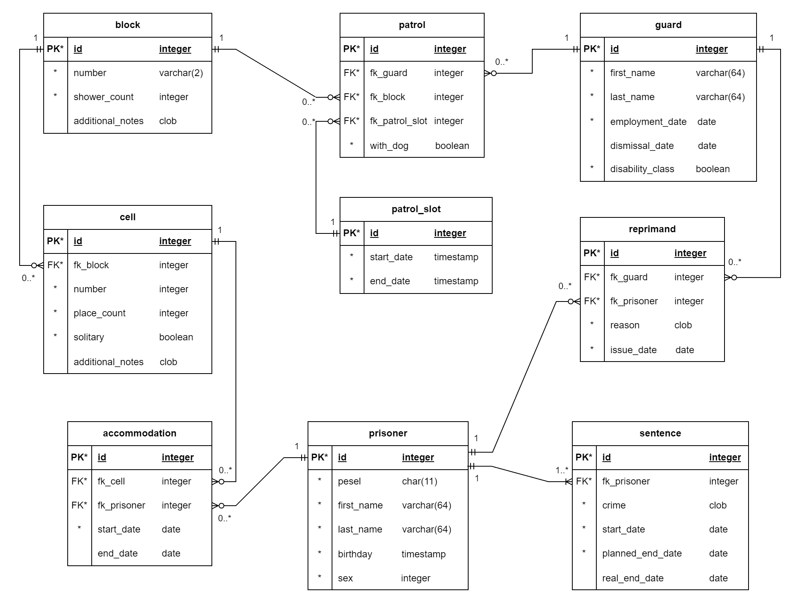

# Zaawansowane systemy baz danych (ZSBD)

Zespół B5 (baza danych dla więzienia):   <b>Tomasz Chojnacki (260365), Kamila Iwańska (253027), Jakub Zehner (260285)</b>

## Zadanie 1 - Model danych

Baza służy do zarządzania więziennym systemem informatycznym, umożliwi ona osobom administrującym więzieniem gromadzenie oraz przetwarzanie wszelkich danych niezbędnych w procesie sprawnej organizacji zakładu, strażników, więźniów oraz odbywanych kar. Przeznaczeniem projektowanej bazy danych jest umożliwienie gromadzenia, wyszukiwania, sortowania i czytelnego prezentowania danych dotyczących osób skazanych na karę pozbawienia wolności wraz z ich wyrokami, naganami i celą więzienną. Dodatkowo zapisywane będą informacje odnośnie strażników oraz spis bloków więziennych wraz z celami które się w nich znajdują i miejscami w celach. Spowoduje to przyspieszenie procesu zarządzania zakładem karnym oraz ułatwi prezentowanie danych dotyczących funkcjonowania.

